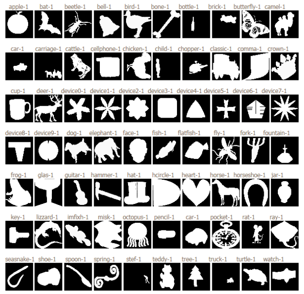

# Demo
## Abstract
The dissimilarity between two contours is a major problem in computer vision systems that must distinguish and cluster different contours. In this contribution a quantitative approach for measuring dissimilarity between contours is proposed. Any contour can be represented by the slope chain code, which is invariant under translation, rotation, and scale. The proposed method normalized both contours with same number of segments, then generates sub-chains of accumulate slope chain and calculates the energy between them. The sub-chains returning a normalized dissimilarity value from 0 to 1. The algorithm was validated with the MPEG7 database, which include 1400 contours and the measure of dissimilarity is available in Matlab.

    

